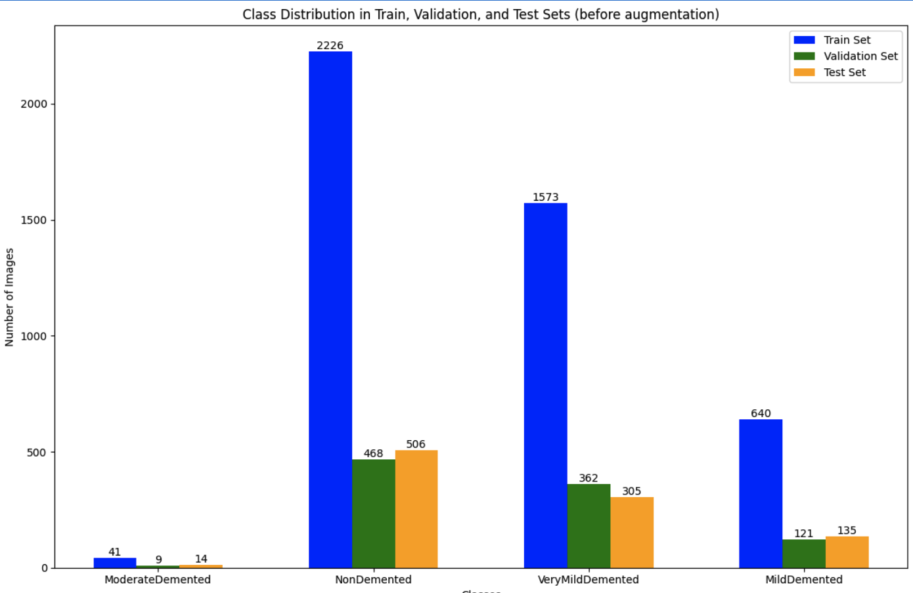
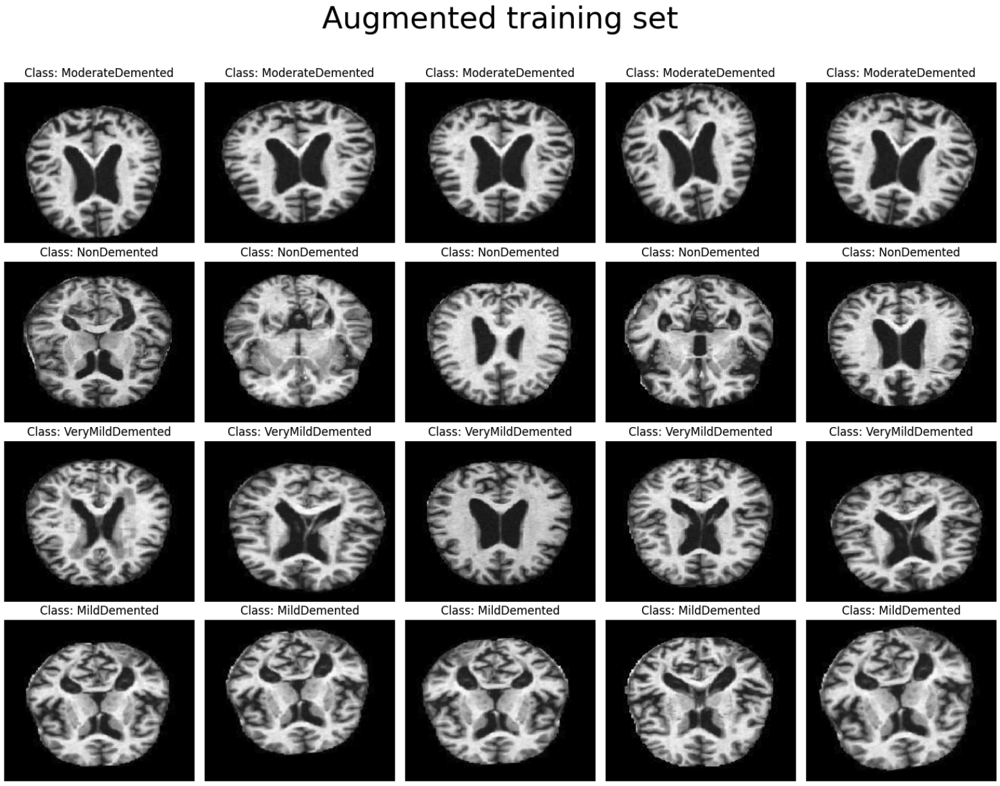

# Classificazione Multiclasse dell'Alzheimer Basata su CNN

Questa repository contiene il codice e la documentazione per il progetto "Classificazione Multiclasse dell'Alzheimer Basata su Reti Neurali Convoluzionali Profonde", sviluppato da Giovanni Cirigliano e Annarita Bruno. Abbiamo testato tre diverse configurazioni di dati per addestrare e valutare il modello:
- Addestramento con dataset sbilanciato senza data augmentation.
- Addestramento con data augmentation applicata solo al set di addestramento.
- Addestramento con data augmentation applicata a tutti i set (training, validation e test).

Nella configurazione migliore, il modello ha raggiunto un'accuratezza del **98.23%** sul test set, dimostrando la capacità di classificare in modo efficace i diversi stadi della malattia di Alzheimer utilizzando immagini MRI.

## Indice
- [Introduzione](#introduzione)
- [Dataset](#dataset)
- [Architettura del Modello](#architettura-del-modello)
- [Ambiente di Addestramento](#ambiente-di-addestramento)
- [Risultati](#risultati)

## Introduzione

L'Alzheimer (AD) è una malattia neurodegenerativa progressiva che causa un deterioramento graduale e irreversibile delle funzioni cognitive. I pazienti affetti da Alzheimer subiscono un declino costante delle capacità mnemoniche, cognitive e comportamentali. Questo processo compromette progressivamente le abilità sociali, rendendo sempre più difficile svolgere le normali attività quotidiane, con gravi conseguenze sulla qualità della vita e sull'autonomia personale. Nonostante decenni di ricerche, non esiste ancora una cura definitiva per l'Alzheimer, rendendo cruciale la diagnosi precoce per migliorare la qualità di vita dei pazienti e rallentare l'avanzamento della malattia. Questo progetto utilizza immagini MRI del cervello per classificare i pazienti in diversi stadi della malattia attraverso una rete neurale convoluzionale, con l’obiettivo di supportare il processo diagnostico.

## Dataset

Per il progetto, abbiamo utilizzato il **Alzheimer's Dataset (4 Class of Images)**, disponibile su Kaggle al seguente [link](https://www.kaggle.com/datasets/tourist55/alzheimers-dataset-4-class-of-images/data). Questo dataset contiene un totale di 6.400 immagini MRI del cervello, suddivise in quattro categorie:

1. **Non Demented** (Soggetti non affetti da demenza)
2. **Very Mild Demented** (Soggetti con demenza molto lieve)
3. **Mild Demented** (Soggetti con demenza lieve)
4. **Moderate Demented** (Soggetti con demenza moderata)

### Preprocessing

Le immagini del dataset sono in scala di grigi e sono state ridimensionate a 176x208 pixel, riducendo così la complessità computazionale durante l'elaborazione. Il dataset originale era suddiviso solo in training e test set, ma per migliorare il processo di addestramento del modello, abbiamo ridistribuito i dati in modo casuale nelle seguenti proporzioni:
- **Training Set**: 70% dei dati
- **Validation Set**: 15% dei dati
- **Test Set**: 15% dei dati

Prima di addestrare il modello, abbiamo applicato delle tecniche di **data augmentation** per bilanciare il dataset e migliorare la capacità di generalizzazione del modello. Le trasformazioni applicate includono:

- **Rotazioni**
- **Traslazioni**
- **Zoom**
- **Flip orizzontali**

Di seguito è riportata una lista di esempi di immagini del training set modificate attraverso tecniche di data augmentation.

## Architettura del Modello

L'architettura della CNN è composta dai seguenti strati:
- **3 Strati Convoluzionali**: con filtri di dimensione 3x3 e profondità crescente (32, 64, 128).
- **Strati di MaxPooling**: applicati dopo ogni strato convoluzionale per ridurre le dimensioni delle feature maps.
- **Strato Fully Connected**: uno strato denso con 512 neuroni e attivazione ReLU.
- **Strato Dropout**: con una percentuale di dropout del 50% per prevenire l'overfitting.
- **Strato di Output**: attivazione softmax con 4 neuroni in uscita, corrispondenti alle quattro classi.

## Ambiente di Addestramento

Il modello è stato addestrato utilizzando la piattaforma Kaggle, che fornisce risorse di calcolo avanzate per eseguire modelli di machine learning. In particolare, l'addestramento del modello è stato eseguito con la seguente configurazione hardware:

- **GPU**: NVIDIA Tesla P100 con 16 GB di memoria
- **CPU**: Intel® Xeon® a 2,20 GHz con 4 core
- **RAM**: 29 GB di memoria

## Risultati

Dopo l'addestramento, il modello ha prodotto i seguenti risultati in termini di accuratezza e capacità di generalizzazione. Di seguito sono riportate le performance del modello per le diverse configurazioni:

### Modello con Dataset Sbilanciato (Senza Data Augmentation)
- **Numero di Epoche**: 25
- **Learning Rate**: 0.0001
- **Test Accuracy**: 97.71%
- **Test Loss**: 0.1229

### Modello con Augmentazione del Training Set
- **Numero di Epoche**: 25
- **Learning Rate**: 0.0001
- **Test Accuracy**: 98.23%
- **Test Loss**: 0.0819

### Modello con Augmentazione di Tutti i Set (Training, Validation e Test)
- **Numero di Epoche**: 6 (Early Stopping)
- **Learning Rate**: 0.0001
- **Test Accuracy**: 28.61%
- **Test Loss**: 2.0714

### Metriche di Valutazione

Per valutare ulteriormente le prestazioni del modello, abbiamo utilizzato le seguenti metriche:

- **Accuracy**: Percentuale di previsioni corrette sul totale delle previsioni.
- **Precision**: Percentuale di veri positivi su tutte le previsioni positive.
- **Recall**: Capacità del modello di identificare correttamente i casi positivi.
- **F1-Score**: Media armonica tra Precision e Recall, utile per valutare la performance su dataset sbilanciati.

